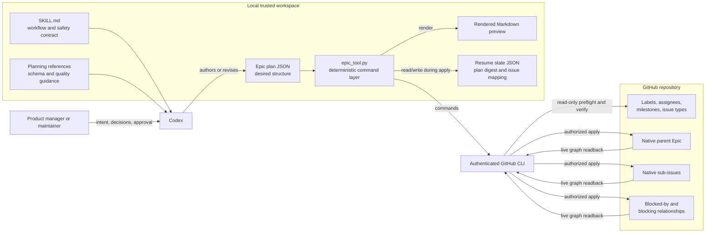
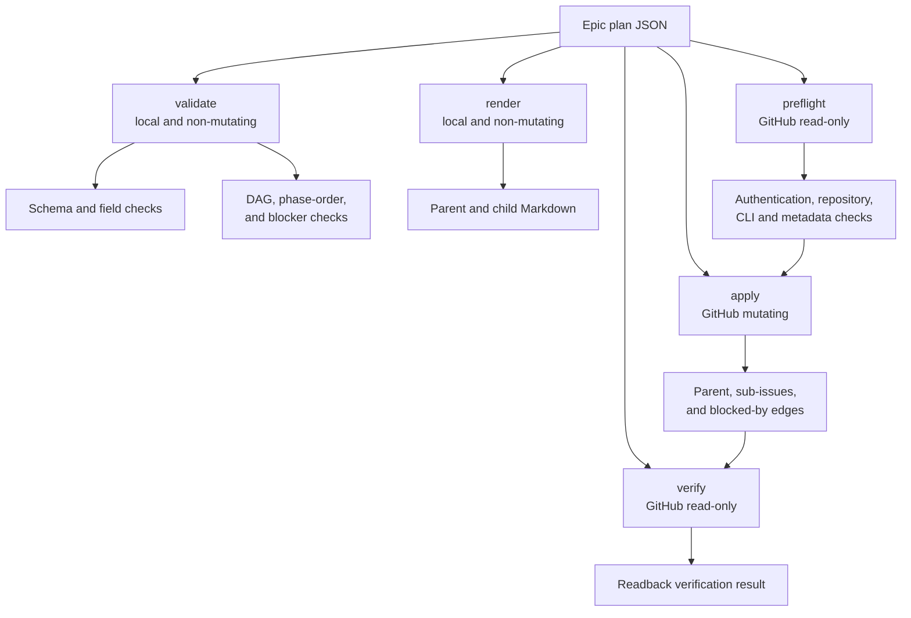
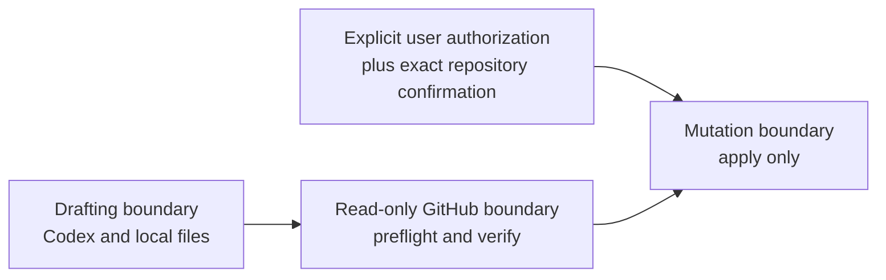

# System architecture

## Purpose

The GitHub Epic Creation skill converts a broad initiative into a reviewable plan and, only after explicit authorization, a verified native GitHub issue graph. Its architecture deliberately separates reasoning and local artifact generation from external mutation.

The system is a local Codex skill plus a Python command-line tool. It is not a hosted service and has no database or long-running process.

## System context

## Components and responsibilities

| Component | Responsibility | Must not do |
|---|---|---|
| `SKILL.md` | Tell Codex when and how to design an Epic, including authorization boundaries | Encode repository-specific product requirements as universal rules |
| `references/plan-format.md` | Define the JSON plan contract and command usage | Become a second implementation of validation |
| `references/epic-quality.md` | Guide decomposition, phasing, evidence, and dependency judgment | Prescribe arbitrary phase counts or issue counts |
| Epic plan JSON | Declare the intended parent, phases, children, metadata, and blockers | Claim that GitHub mutations have already succeeded |
| `scripts/epic_tool.py` | Validate, render, preflight, apply, persist resume state, and verify | Infer approval, replace parents, close issues, merge pull requests, or approve release |
| Rendered preview | Make proposed issue bodies reviewable before mutation | Act as the authoritative hierarchy or dependency graph |
| Resume state | Map stable plan keys to created issue numbers and protect partial runs from duplication | Replace GitHub as the authority for current issue relationships |
| GitHub CLI | Supply authenticated transport to GitHub | Expose credentials to the plan, logs, or generated documentation |
| GitHub Issues | Store the live parent/sub-issue hierarchy and dependency graph | Define product requirements that were absent from the approved plan |

## Command architecture

All commands run the local plan validator first. `apply` repeats preflight immediately before the first live mutation so a previously successful preflight is never treated as permanent authorization or current repository truth.

## Sources of truth

The system has different authorities at different stages:

1. **Before live creation:** the reviewed Epic plan is the desired-state declaration.
2. **During a partial apply:** GitHub is authoritative for mutations that actually succeeded; the resume state is the local durable mapping used to continue safely.
3. **After apply:** GitHub's native parent, sub-issue, and dependency relationships are authoritative. Rendered Markdown is explanatory only.
4. **For product acceptance:** linked verification evidence and required human approval remain authoritative. The tool never declares release safety on its own.

## Trust and authorization boundaries

- `validate` and `render` do not contact or mutate GitHub.
- `preflight` and `verify` contact GitHub but do not change issue state.
- `apply` is the only mutating command.
- The `--confirm-repository OWNER/REPO` value must exactly match the plan target.
- GitHub authentication remains owned by the GitHub CLI credential store; the skill does not accept or persist tokens.

## Failure and consistency model

Live issue creation is a sequence of GitHub operations, not one transaction. The architecture therefore favors resumability over attempted rollback:

- preflight rejects missing access or metadata before the first issue is created;
- the state file is updated after every successful parent or child creation;
- dependency creation reads the current live relationships and adds only missing edges;
- body rewrites are safe to repeat;
- verification reads the native hierarchy and blockers back from GitHub;
- a plan digest mismatch fails closed because continuing with changed intent can corrupt or duplicate the graph; and
- uncertain network outcomes require manual inspection for embedded plan markers before retrying.

The tool does not delete partially created issues automatically. Automatic rollback would be destructive and could erase work that GitHub accepted even when the client did not receive a clear response.

## Extension points

Safe future extensions include additional local validation, richer preview formats, or more read-only verification. Features that widen mutation scope—such as closing issues, replacing parents, creating labels, or changing project fields—require an explicit contract, authorization model, failure strategy, and tests before implementation.
