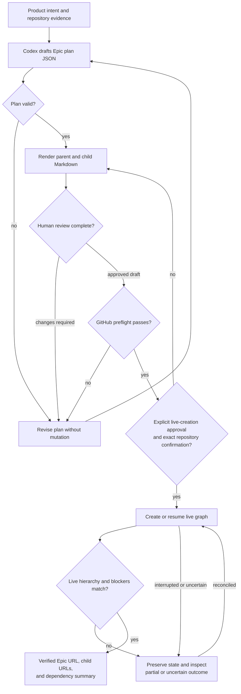
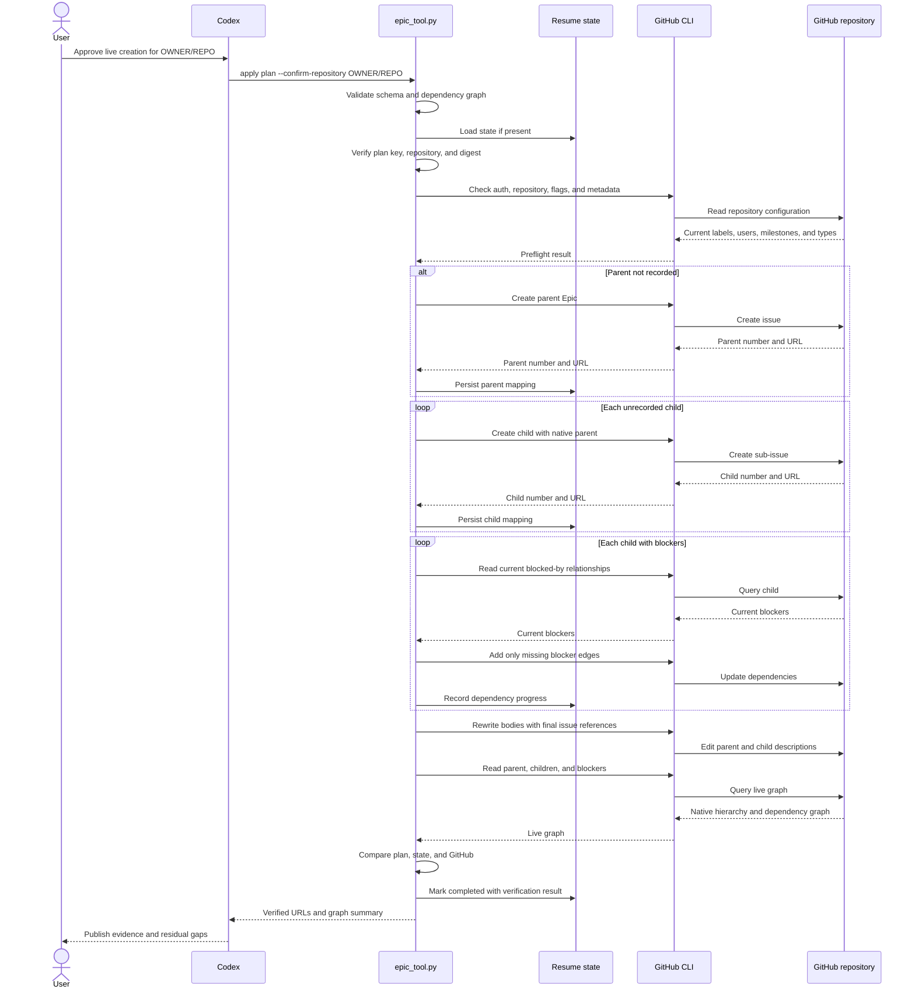
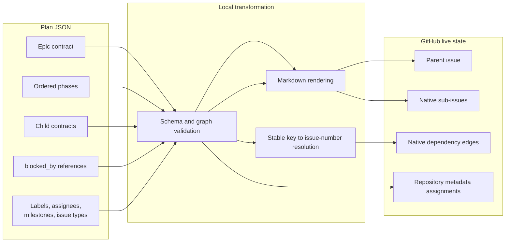

# Data flow

## Overview

The system moves one desired-state plan through five increasingly authoritative stages: validation, preview, repository preflight, live creation, and live verification. Only the fourth stage mutates GitHub.

## End-to-end flow



## Command data paths

| Command | Inputs | Reads | Writes | External mutation |
|---|---|---|---|---|
| `validate` | Plan JSON | Local plan | JSON summary to standard output | None |
| `render` | Plan JSON, optional state | Local plan and optional state | Markdown preview and manifest | None |
| `preflight` | Plan JSON | GitHub authentication, repository, CLI capabilities, labels, assignees, milestones, issue types | JSON readiness summary to standard output | None |
| `apply` | Plan JSON, exact repository confirmation, optional state | Local plan/state and GitHub metadata/relationships | GitHub issues and relationships; local state file | Creates/edits issues and dependencies |
| `verify` | Plan JSON and state | GitHub parent, sub-issues, titles, and blockers | JSON verification summary to standard output | None |

## Apply sequence



## Plan-to-GitHub transformation



Phases remain descriptive roadmap structure in the issue bodies. Child-parent links and dependency edges become native GitHub relationships.

## Resume-state flow

The state file contains operational identity, not product truth:

```text
plan key + repository + plan SHA-256
    -> parent issue number and URL
    -> child key to issue number and URL mappings
    -> completed dependency operations
    -> final verification result
```

It is written atomically after each successful creation. The plan digest prevents a changed plan from silently resuming against issues created from different intent.

## Error and recovery paths

| Failure point | Expected effect | Recovery |
|---|---|---|
| Local validation | No GitHub access or mutation | Correct the plan and rerun |
| Preflight | No issue creation | Fix access, repository metadata, or CLI capability |
| Parent creation before response is known | GitHub outcome may be uncertain | Search for the plan marker before retrying |
| Child creation after earlier children succeeded | Partial native hierarchy remains | Preserve state and rerun after confirming the last outcome |
| Dependency update | Issues exist; some edges may be missing | Rerun; the tool reads current edges and adds only missing ones |
| Body rewrite | Relationships exist; prose may contain incomplete references | Rerun; body edits are repeatable |
| Verification | Live graph differs from the plan | Inspect the reported missing parent or blocker relationships, reconcile, then rerun |
| Plan digest mismatch | Apply stops before continuing | Restore the original plan or manually reconcile the plan, state, and live issues |

## Data that must not flow through the system

- GitHub access tokens or credential-store contents;
- environment dumps;
- secrets embedded in issue bodies or plan metadata;
- invented product requirements, owners, dates, metrics, or approval decisions; and
- claims that a live mutation succeeded without GitHub readback.
